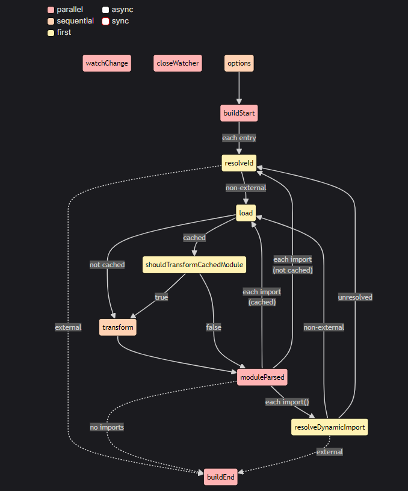

# Handling `Vue style block` and transforming it, finally inserting it into HTML

`playground/vue-demo/src/components/HelloWorld.vue`:

```html
<script setup>
  import { ref } from 'vue'

  const msg = ref('Hello World')
</script>

<template>
  <h1>{{ msg }}</h1>
</template>

<style scoped>
  h1 {
    color: red;
  }
</style>
```

> `vite-plugin-vue` will recognize `.vue` files and parse it with `@vue/compiler-sfc` and generate `descriptor` including script, scriptSetup, template, styles, customBlocks, etc.

## Steps

Below are the steps to handle `Vue style block` within `.vue` file.

### Splitting `.vue` file into multiple parts in `transform` hook

Firstly, call `createDescriptor` function (under the hood, it calls `compiler.parse` in `@vue/compiler-sfc`) to generate descriptor which describes the `.vue` file.

```js
const { descriptor, errors } = createDescriptor(filename, code, options)
```

> check out `playground/vue-demo/src/components/HelloWorld.vue.descriptor.json`.

print `descriptor` to see the result:

```json
{
  // ... ignore other properties
  "styles": [
    {
      "type": "style",
      "content": "\nh1 {\n  color: red;\n}\n",
      "scoped": true,
      // ... ignore other properties
    }
  ],
  "template": '...',
  "script": null,
  "scriptSetup": '...',
  "customBlocks": [...],
  "id": "e17ea971", // component id
}
```

<!-- Now we just care about `styles` property, which is an array of `style` blocks. That's because Vue supports multiple `<style>` tags in a single `.vue` file. -->

Secondly, call `genScriptCode`, `genTemplateCode`, `genStyleCode` and `genCustomBlockCode` to generate the code of scriptCode, templateCode, stylesCode and customBlocksCode respectively.

Pseudo code is like below:

```ts
const { code: scriptCode, map: scriptMap } = await genScriptCode(...)
const { code: templateCode, map: templateMap } = await genTemplateCode(...)
const { code: stylesCode, map: stylesMap } = await genStyleCode(...)
const customBlocksCode = await genCustomBlockCode(...)

const output: string[] = [
  scriptCode,
  templateCode,
  customBlocksCode,
  stylesCode: 'import "D:/www/github/vite-plugin-vue/playground/vue-demo/src/components/HelloWorld.vue?vue&type=style&index=0&scoped=e17ea971&lang.css"',
  // ... other code like hmr, ssr and virtual modules
]

// more detail see `playground/vue-demo/src/components/HelloWorld.vue.(output.json | resolvedCode.js)`
```

For `stylesCode` above, we may wonder how it would be transformed into css and how it would be inserted into `<style>` tag eventually?

Consider the following code:

```js
// ...ignore other code
import 'D:/www/github/vite-plugin-vue/playground/vue-demo/src/components/HelloWorld.vue?vue&type=style&index=0&scoped=e17ea971&lang.css'
// multiple <style> blocks if present
// import 'D:/www/github/vite-plugin-vue/playground/vue-demo/src/components/HelloWorld.vue?vue&type=style&index=1&scoped=e17ea971&lang.css'
// ...
```



Obviously, it will trigger `resolveId`, `load` and `transform` hooks again when executing [moduleParsed](https://rollupjs.org/plugin-development/#moduleparsed) hook to resolves all discovered static imports.

As virtual modules in resolveId hook:

```js
async function resolveId(id) {
  // serve sub-part requests (*?vue) as virtual modules
  if (parseVueRequest(id).query.vue) {
    return id
  }
}
```

Get `<style>` block's content in load hook:

```ts
function load(id: string) {
  const { filename, query } = parseVueRequest(id)
  // select corresponding block for sub-part virtual modules
  if (query.vue) {
    const descriptor = getDescriptor(filename, options.value)!
    let block: SFCBlock | null | undefined

    // ...ignore other if-condition blocks

    if (query.type === 'style') {
      block = descriptor.styles[query.index!]
    }
    if (block) {
      return {
        code: block.content, // here is: "h1 {color: red;}"
        map: block.map as any,
      }
    }
  }
}
```

Finally, transform the `<style>` block's content in transform hook, which process will call `transformStyle` function (under the hood, it's `compiler.compileStyleAsync` (@vue/compiler-sfc)) to generate the end css string.

```ts
async function transform(code, id, opt) {
  const { filename, query } = parseVueRequest(id)
  const descriptor = query.src
    ? getSrcDescriptor(filename, query) || getTempSrcDescriptor(filename, query)
    : getDescriptor(filename, options.value)!

  // ...ignore other if-condition blocks

  if (query.type === 'style') {
    const result = await transformStyle(
      code,
      descriptor,
      Number(query.index || 0),
      options.value,
      this,
      filename,
    )
    return result
  }
  // output:
  // {
  //   code: 'h1[data-v-e17ea971] {color: red;}',
  //   map: {
  //     // ...
  //   },
  // }
}
```

Raw code of `<style>` block:

```html
<style scoped>
  h1 {
    color: red;
  }
</style>
```

After `vite:vue` plugin process the `<style>` block, it will be transformed into: "h1[data-v-e17ea971] {color: red;}"

After `vite:css-post` plugin process former code, it will be transformed into:

`vite\packages\vite\src\node\plugins\css.ts#cssPostPlugin`:

```js
import {
  updateStyle as __vite__updateStyle,
  removeStyle as __vite__removeStyle,
} from '/@vite/client'
const __vite__id =
  'D:/www/github/vite-plugin-vue/playground/vue-demo/src/components/HelloWorld.vue?vue&type=style&index=0&scoped=e17ea971&lang.css'
const __vite__css = '\nh1[data-v-e17ea971] {\n  color: red;\n}\n'
__vite__updateStyle(__vite__id, __vite__css)
import.meta.hot.accept()
import.meta.hot.prune(() => __vite__removeStyle(__vite__id))
```

`updateStyle` function looks like this:

`vite\packages\vite\src\client\client.ts#updateStyle`

```ts
export function updateStyle(id: string, content: string): void {
  let style = sheetsMap.get(id)
  if (!style) {
    style = document.createElement('style')
    style.setAttribute('type', 'text/css')
    style.setAttribute('data-vite-dev-id', id)
    style.textContent = content
    // insert into html
    document.head.appendChild(style)
  } else {
    style.textContent = content
  }
  sheetsMap.set(id, style)
}
```
